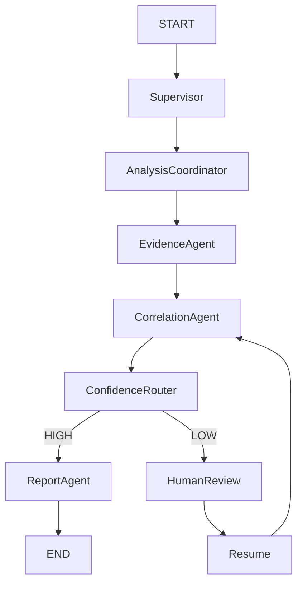

# LangGraph Visualization

This document provides visual representations of our SRE Copilot LangGraph architecture.

## ASCII Diagram

```text
                  START
                    |
                    v
              Supervisor
                    |
                    v
          Analysis Coordinator
                    |
                    v
            Evidence Agent
                    |
                    v
          Correlation Agent
                    |
                    v
          Confidence Router
              HIGH       LOW
               |          |
               v          v
          Report Agent   Human Review
               |          |
               |       Resume
               |          |
               |          v
               |    Correlation Agent
               |
               v
              END
```

## Mermaid Diagram


