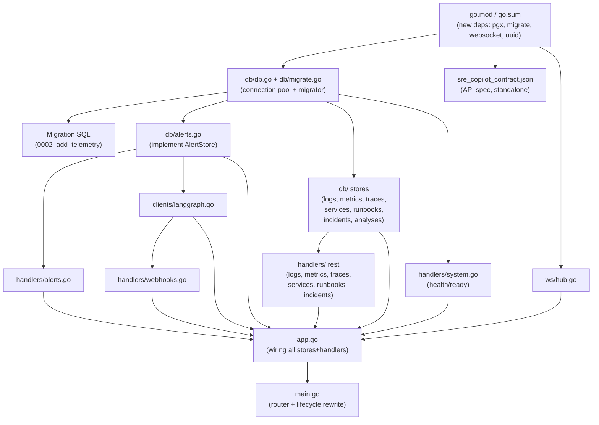

# Git Push Staging Plan

## Current State

**Last commit:** `5849bab` — *"add configuration loader, domain models, and security/logging middleware"*
- Added: `config.go`, `middleware/auth.go`, `middleware/logger.go`, `middleware/requestid.go`, `models/models.go`

**Total uncommitted changes:** ~4,357 lines across 25 files (6 tracked modifications + 19 untracked new files)

## Change Inventory

| Category | Files | Lines | Status |
|----------|-------|-------|--------|
| API Contract | `sre_copilot_contract.json` | 1,056 | new |
| Go module deps | `go.mod`, `go.sum` | ~126 changed | modified |
| DB connection & migration | `db/db.go`, `db/migrate.go` | 82 | new |
| Migration SQL | `0002_add_telemetry.up.sql`, `0002_add_telemetry.down.sql` | 93 | new |
| Old migration cleanup | `001_create_alerts.up.sql`, `001_create_alerts.down.sql` | — | deleted |
| DB stores (7 files) | `db/alerts.go` + 6 new stores | ~1,531 | modified + new |
| HTTP handlers (9 files) | `handlers/*.go` | 1,128 | new |
| WebSocket hub | `ws/hub.go` | 236 | new |
| External client | `clients/langgraph.go` | 118 | new |
| App wiring | `app.go` | 113 | new |
| Main rewrite | `main.go` | ~188 changed | modified |

## Dependency Graph

## Proposed Commits (in order)

> [!IMPORTANT]
> Each commit below is designed so the Go code **compiles independently** after that commit (no broken intermediate states). The order matters because of import dependencies.

---

### Commit 1 — API contract spec
**Message:** `add SRE copilot API contract specification`

| File | Action |
|------|--------|
| `sre_copilot_contract.json` | add |

**Rationale:** This is a pure JSON spec file with zero code dependencies. It documents the entire REST/WebSocket/Webhook API surface. Pushing it first makes the contract reviewable before any implementation lands.

**~1,056 lines**

---

### Commit 2 — Add new Go dependencies
**Message:** `add pgx, golang-migrate, gorilla/websocket, and uuid dependencies`

| File | Action |
|------|--------|
| `go_backend/go.mod` | modify |
| `go_backend/go.sum` | modify |

**Rationale:** Bumps Go version to 1.25.0 and adds the 4 new direct dependencies (`pgx/v5`, `golang-migrate/v4`, `gorilla/websocket`, `google/uuid`) needed by subsequent commits. Pushing deps alone keeps the diff reviewable.

**~126 lines changed**

---

### Commit 3 — Database connection pool and migration runner
**Message:** `add database connection pool and migration runner`

| File | Action |
|------|--------|
| `go_backend/db/db.go` | add |
| `go_backend/db/migrate.go` | add |

**Rationale:** These two small files (~82 lines) set up the `pgxpool` connection and the `golang-migrate` runner. They're the foundation that all DB stores depend on, but have no dependencies on any store code.

**~82 lines**

---

### Commit 4 — Telemetry migration SQL + old migration cleanup
**Message:** `add telemetry schema migration and remove legacy alert-only migration`

| File | Action |
|------|--------|
| `go_backend/db/migrations/0002_add_telemetry.up.sql` | add |
| `go_backend/db/migrations/0002_add_telemetry.down.sql` | add |
| `go_backend/db/migrations/001_create_alerts.up.sql` | delete |
| `go_backend/db/migrations/001_create_alerts.down.sql` | delete |

**Rationale:** Adds the new migration (logs, metrics, spans, services, service_dependencies tables) and removes the old `001_create_alerts` migration files that were superseded. The alerts table schema from 001 is presumably already captured in the DB or will be re-incorporated; the new 0002 adds the remaining telemetry tables.

> [!WARNING]
> Deleting `001_create_alerts.*.sql` means anyone running from scratch needs the alerts table to already exist or you need to bring back a consolidated `0001` migration. Please confirm this is intentional or if the alerts migration should be preserved/renumbered.

**~93 lines added, ~19 lines deleted**

---

### Commit 5 — Alert store implementation
**Message:** `implement alert database store with CRUD, acknowledge, and suppress`

| File | Action |
|------|--------|
| `go_backend/db/alerts.go` | modify (was empty package stub → full implementation) |

**Rationale:** This is the first store implementation. It was already tracked (just a `package db` stub), so it's a modification. The AlertStore interface + implementation (~237 lines) stands alone — it depends only on `models` (already pushed) and `pgxpool` (commit 2-3).

**~237 lines**

---

### Commit 6 — Remaining database stores (6 files)
**Message:** `add database stores for logs, metrics, traces, services, runbooks, and incidents`

| File | Action |
|------|--------|
| `go_backend/db/logs.go` | add |
| `go_backend/db/metrics.go` | add |
| `go_backend/db/traces.go` | add |
| `go_backend/db/services.go` | add |
| `go_backend/db/runbooks.go` | add |
| `go_backend/db/incidents.go` | add |
| `go_backend/db/analyses.go` | add |

**Rationale:** All 7 remaining store files follow the same pattern as AlertStore. They depend on `models` + `pgxpool` but nothing else. Grouping them keeps the "data layer" coherent.

**~1,293 lines**

> [!TIP]
> If this feels too large, we could split it into two commits: one for core telemetry stores (logs, metrics, traces) and one for operational stores (services, runbooks, incidents, analyses).

---

### Commit 7 — HTTP handlers, WebSocket hub, LangGraph client, app wiring, and main rewrite
**Message:** `add HTTP handlers, WebSocket hub, LangGraph client, and rewire main.go`

| File | Action |
|------|--------|
| `go_backend/handlers/alerts.go` | add |
| `go_backend/handlers/logs.go` | add |
| `go_backend/handlers/metrics.go` | add |
| `go_backend/handlers/traces.go` | add |
| `go_backend/handlers/services.go` | add |
| `go_backend/handlers/runbooks.go` | add |
| `go_backend/handlers/incidents.go` | add |
| `go_backend/handlers/system.go` | add |
| `go_backend/handlers/webhooks.go` | add |
| `go_backend/ws/hub.go` | add |
| `go_backend/clients/langgraph.go` | add |
| `go_backend/app.go` | add |
| `go_backend/main.go` | modify |

**Rationale:** This is the "top of the stack" — handlers import stores, `app.go` wires everything, and `main.go` is rewritten to use the new `App` struct with real handlers instead of inline stubs. These must land together because `main.go` references `app.go` which references all handlers and stores.

**~1,847 lines**

> [!TIP]
> If this also feels too large, we could further split as:
> - **7a:** `ws/hub.go` + `clients/langgraph.go` (standalone utility packages, ~354 lines)
> - **7b:** All `handlers/*.go` (~1,128 lines)
> - **7c:** `app.go` + `main.go` (wiring + rewrite, ~301 lines)
>
> However, **7b and 7c can't compile independently** — `main.go` imports handlers that aren't committed yet. We'd need to use `--no-verify` or temporary stubs to make intermediate states compile. The clean approach is to push 7a–7c together.

---

## Recommendation: Start with Commit 1

**Push `sre_copilot_contract.json` first.** It's:
- Zero risk (pure JSON, no code changes)
- Self-contained and meaningful
- Sets the stage for reviewers to understand the API surface before implementation arrives

After that, proceed with Commits 2 → 3 → 4 → 5 → 6 → 7 in order.

## Open Questions

1. **Old migration deletion (Commit 4):** Should we keep `001_create_alerts.up.sql` or has the alerts table already been created in production? If starting fresh, we need the alerts table defined somewhere.

2. **Commit 6 granularity:** Do you want to split the 7 DB stores into smaller groups (e.g., telemetry vs operational), or is one commit for all stores acceptable?

3. **Commit 7 granularity:** Do you want to attempt splitting handlers/websocket/client/wiring into sub-commits (requires `--no-verify` to skip build checks at intermediate states), or keep it as one big final commit?
